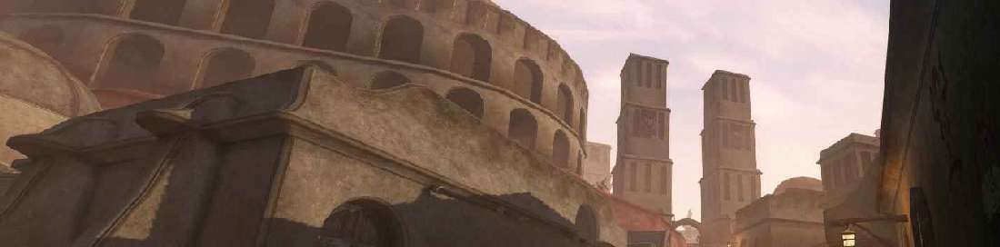

# OpenMW modlist by Jaume Alcazo (WIP)

My modlist compilation for OpenMW, thanks to all the authors! I plan on doing a [collection](https://next.nexusmods.com/) on [Nexusmods](https://www.nexusmods.com/skyrimspecialedition) with this modlist and maybe a [Wabbajack](https://www.wabbajack.org/) modlist. Contact me at jaume.alcazo@gmail.com

(Tamriel Rebuilt image)

# Essential (many mods need these)

| Number | Mod | Brief explanation | Spanish translation |
|----------|----------|----------|----------|
| Total in this category: | 0 mods | | |

# Fixes/helpers

| Number | Mod | Brief explanation | Spanish translation |
|----------|----------|----------|----------|
| Total in this category: | 0 mods | | |

 

# Armor, armors

| Number | Mod |  Brief explanation | Spanish translation |
|----------|----------|----------|----------|
| Total in this category: | 0 mods | | |

# Gameplay

| Number | Mod |  Brief explanation | Spanish translation | Video review |
|----------|----------|----------|----------|----------|
| 1 | [Protective Guards (OpenMW)](https://www.nexusmods.com/morrowind/mods/46992) | todo | todo | same vid as below, merge cells |
| 2 | [Protective Guards - Factions and NPCs Protections (OpenMW)](https://www.nexusmods.com/morrowind/mods/54858?tab=files&file_id=1000052819&nmm=1) | Expansion/refinement of Protective Guards (needs original). OpenMW. | todo | [Morrowind Mod of the Day - Protective Guards Showcase](https://www.youtube.com/watch?v=bcwN81_UAU4) |
| Total in this category: | 2 mods | | |

# Meshes

| Number | Mod |  Brief explanation | Spanish translation | Video review |
|----------|----------|----------|----------|----------|
| Total in this category: | 0 mods | | |

# GUI / Interface / User Interface

| Number | Mod |  Brief explanation | Spanish translation |
|----------|----------|----------|----------|
| Total in this category: | 0 mods | | |

 
# Magic / Spells

| Number | Mod |  Brief explanation | Spanish translation | Video review |
|----------|----------|----------|----------|----------|
| Total in this category: | 0 mods | | |

# OAAB

| Number | Mod |  Brief explanation | Spanish translation | Video review |
|----------|----------|----------|----------|----------|
| 1 | [OAAB Greater Samarys Tomb](https://www.nexusmods.com/morrowind/mods/52781) | This is a long overdue update to my Greater Samarys mod from 2016. Expands on the original mod, adds new encounters, fixes bugs, and adds a few other features. Now requires OAAB_Data. | todo | :tv: [Morrowind Mod of the Day - Greater Samarys Showcase](https://www.youtube.com/watch?v=cybL1flRP-g) |
| Total in this category: | 1 mod | | |

# Combat

| Number | Mod |  Brief explanation | Spanish translation | Video review |
|----------|----------|----------|----------|----------|
| Total in this category: | 0 mods | | |

# Immersion

| Number | Mod | Brief explanation | Spanish translation | Video review |
|----------|----------|----------|----------|----------|
| Total in this category: | 0 mods | | |

# Cities

| Number | Mod | Brief explanation | Spanish translation | Video review |
|----------|----------|----------|----------|----------|
| Total in this category: | 0 mods | | |

# Alchemy / Potions / Ingredients / Food

| Mod | Brief explanation | Spanish translation |
|----------|----------|----------|
| Total in this category: | 0 mods | | |

# Monsters / Creatures

| Mod | Brief explanation | Spanish translation |
|----------|----------|----------|
| Total in this category: | 0 mods | | |

# Weather / fog / fogs / mists

| Mod | Brief explanation | Spanish translation |
|----------|----------|----------|
| Total in this category: | 0 mods | | |

:tv: [Video review of Cathedral Weathers (comparison with other weathers)](https://www.youtube.com/watch?v=p_CMoTK-8bM)

# Animals, horses, hunting, fauna, wildlife, etc.

| Mod | Brief explanation | Spanish translation |
|----------|----------|----------|
| Total in this category: | 0 mods | | |

# NPC's

| Number | Mod | Brief explanation | Spanish translation | Video review |
|----------|----------|----------|----------|----------|
| Total in this category: | 0 mods | | |

# Expansions / DLC sized expansions

| Number | Mod | Brief explanation | Spanish translation | Video review |
|----------|----------|----------|----------|----------|
| Total in this category: | 0 mods | | |

# Flora

| Mod | Brief explanation | Spanish translation |
|----------|----------|----------|
| Total in this category: | 0 mods | | |

# Animations (OAR replaces DAR and it's fully compatible with DAR animations)

| Number | Mod | Brief explanation | Spanish translation |
|----------|----------|----------|----------|
| Total in this category: | 0 mods | | |

# Map

| Number | Mod | Brief explanation | Spanish translation | Video review |
|----------|----------|----------|----------|----------|
| Total in this category: | 3 mods | | |

# Paper map (optional)

| Number | Mod | Brief explanation | Spanish translation | Video review |
|----------|----------|----------|----------|----------|
| Total in this category: | 1 mods | | |

# Audio / SFX / Sound / Soundtrack / Music

| Number | Mod | Brief explanation | Spanish translation | Video review |
|----------|----------|----------|----------|----------|
| Total in this category: | 0 mods | | |

# Character creation / presets / roleplaying / RPG

| Number | Mod | Brief explanation | Spanish translation | Video review |
|----------|----------|----------|----------|----------|
| Total in this category: | 0 mods | | |

# Textures

| Mod | Brief explanation | Spanish translation |
|----------|----------|----------|
| Total in this category: | 0 mods | | |

# Forts

| Mod | Brief explanation | Spanish translation |
|----------|----------|----------|
| Total in this category: | 0 mods | | |

# ⛓️ Dungeons

| Number | Mod | Brief explanation | Spanish translation | Video review |
|----------|----------|----------|----------|----------|
| 1 | [Kogoruhn - Extinct City of Ash and Sulfur](https://www.nexusmods.com/morrowind/mods/51615) | The Nerevarine discovers Kogoruhn, the ancient [Chimer](https://elderscrolls.fandom.com/wiki/Chimer) capital, now a buried ruin overtaken by the [Sixth House's](https://en.uesp.net/wiki/Morrowind:Sixth_House) horrors beneath Red Mountain's shadow. | todo | :tv: [Review by DarkElfGuy](https://www.youtube.com/watch?v=OxNOKW2xrog) |
| 2 | [Terror of Tel Amur](https://www.nexusmods.com/morrowind/mods/53673) | Adds a series of heists and a quest to investigate a mysterious new tower deep in the Molag Amur wilderness. | todo | :tv: [Review by DarkElfGuy](https://www.youtube.com/watch?v=7QCnRgTV6LU) |
| 3 | [Daedric Shrine Overhaul Vaermina](https://www.nexusmods.com/morrowind/mods/53242) | Turns Kushtashpi into a shrine to Vaermina (instead of Molag Bal) | todo | [Review by DarkElfGuy](https://www.youtube.com/watch?v=2MKpwBbTQ_k) |
| 4 | [Sea Forts of Morrowind](https://www.nexusmods.com/morrowind/mods/54700) | 4 Regions, 4 Themes, 4 Sea Forts! Above the wave's upon the horizon sits a Sea Fortress, these act as mini dungeons for plundering, which sit a good swim away. Don't forget to use those ladders! | todo | :tv: [Review by DarkElfGuy](https://www.youtube.com/watch?v=GgQY-rGqEAE) |
| 5 | [UnderCity](https://www.nexusmods.com/morrowind/mods/54773) | An overhaul of Old Mournhold, as well as the Dwemer and Daedric ruins beneath. | todo | :tv: [Review by DarkElfGuy](https://www.youtube.com/watch?v=knO9fSZd7xg) |
| 6 | [AATL_Data](https://www.nexusmods.com/morrowind/mods/50647) | requiered by undercity | todo | no |
| 7 | [Skeeve Den Cult of Namira](https://www.nexusmods.com/morrowind/mods/52953) | A new Daedric dungeon built within the depths of a blightened egg mine. | todo | ? |
| 8 | [Sea Forts of Morrowind](https://www.nexusmods.com/morrowind/mods/54700) | Compatible with Tamriel Rebuilt and Waters of Morrowind. | todo | [Morrowind Mod of the Day - Sea Forts of Morrowind Showcase](https://www.youtube.com/watch?v=GgQY-rGqEAE) |
| 9 | [Hammerfell Ansei Warrior Armour](https://www.nexusmods.com/morrowind/mods/53822) | Dungeon and armor mod. | todo | :tv: [Morrowind Mod of the Day - Hammerfell Ansei Armor Showcase](https://www.youtube.com/watch?v=1ww2Yj2LkuM) |
| Total in this category: | 9 mods | | |

# Dwemer ruins (subcategory of dungeons)

| Number | Mod | Brief explanation | Spanish translation | Video review |
|----------|----------|----------|----------|----------|
| 1 | [BDI - Nchuleft](https://www.nexusmods.com/morrowind/mods/52916) | requires Better Dwemer Interiors | todo | :tv: [Morrowind Mod of the Day - Nchuleft Rebuilt 2023 Showcase](https://www.youtube.com/watch?v=3C35CGXsd7I) |
| Total in this category: | 1 mod | | |

# Interiors

| Number | Mod | Brief explanation | Spanish translation | Video review |
|----------|----------|----------|----------|----------|
| 1 | [Azura's Shrine Overhaul](https://www.nexusmods.com/morrowind/mods/53277) | Overhaul of both the exterior and interior of the Shrine of Azura. | todo | :tv: [Morrowind Mod of the Day - Azura's Shrine Overhaul Showcase](https://www.youtube.com/watch?v=Q2cJT8n3l9g) |
| Total in this category: | 1 mod | | |

# Grim and Gore

| Mod | Brief explanation | Spanish translation |
|----------|----------|----------|
| Total in this category: | 0 mods | | |

# Towers and Ruins

| Mod | Brief explanation | Spanish translation |
|----------|----------|----------|
| Total in this category: | 0 mods | | |

# Shrines and statues

| Mod | Brief explanation | Spanish translation |
|----------|----------|----------|
| Total in this category: | 0 mods | | |

# Collectibles

| Mod | Brief explanation | Spanish translation |
|----------|----------|----------|
| Total in this category: | 0 mods | | |

# 🧭 Quests

| Number | Mod | Brief explanation | Spanish translation | Video review |
|----------|----------|----------|----------|----------|
| 1 | [The Guiding Guild - Dune Inspired Guild Guides](https://www.nexusmods.com/morrowind/mods/54750) | Gameplay, quest and faction mod. | todo | :tv: [Review by DarkElfGuy here](https://www.youtube.com/watch?v=cf1HmwOQYMc) |
| 2 | [Dawnbreaker - The Lady of Light](https://www.nexusmods.com/morrowind/mods/52162) | This mod adds in Dawnbreaker as well as a full quest with a unique and lore friendly story, new npcs, and a shrine to Meridia. | todo | :tv: [Review by DarkElfGuy here](https://www.youtube.com/watch?v=TGRjTKEbt3Y) |
| 3 | [A Lovers' Quarrel](https://www.nexusmods.com/morrowind/mods/52679) | Quest for Tamriel Rebuilt about a marital dispute in Necrom. | todo | :tv: [Review by DarkElfGuy here](https://www.youtube.com/watch?v=RA1OBNSVjY0) |
| 4 | [The Tri-Angled Truth](https://www.nexusmods.com/morrowind/mods/54722) |Work for the Center for Provincial Religious Studies in Caldera to uncover the mystery of the Prophet Veloth and learn the Tri-Angled Truth. Are you enlightened enough to get the opportunity to read Veloth's greatest teaching? Adds achievements too. | todo | todo |
| 5 | [Lord of Rebirth](https://www.nexusmods.com/morrowind/mods/53680) | todo | todo | :tv: [Morrowind Mod of the Day - Lord of Rebirth Showcase](https://www.youtube.com/watch?v=-CWRVFatXNU) |
| 6 | [Ius the Animal God](https://www.nexusmods.com/morrowind/mods/52837) | Ius the Animal God has a questline full of adventure, drama, comedy, and romance, not to mention an artifact weapon, a companion, and more! | todo | :tv: [Morrowind Mod of the Day - Ius - The Animal God Showcase](https://www.youtube.com/watch?v=K5Xz4CX-Rc0) |
| 7 | [The Vanishing Ash-chirps - A Quest Mod](https://www.nexusmods.com/morrowind/mods/52870) | Deep in the Grazelands, a Khajiit scholar has gone missing while studying the mysterious Ashlander culture. Rumors suggest she sought out a reclusive hermit for answers. Can you unravel the secrets she uncovered? | todo | :tv: [Morrowind Mod of the Day - The Vanishing Ash-Chirps Showcase](https://www.youtube.com/watch?v=XnrDLa8317Y) |
| 8 | [Goldbrand Reforged - The Quest for Eltonbrand](https://www.nexusmods.com/morrowind/mods/52277) | Brave the dangers of Vvardenfell in this lore-friendly quest mod to reforge Goldbrand into the mysterious Eltonbrand. Speak to Sirilonwe in the Vivec Mages Guild while carrying Goldbrand to begin the quest. Part of the 2023 Winter Modjam. | todo | :tv: [Morrowind Mod of the Day - Goldbrand Reforged Showcase](https://www.youtube.com/watch?v=p5x4l1MYMnw) |
| 9 | [Of Melodies and Moonlight - A Sadrith Mora Artist](https://www.nexusmods.com/morrowind/mods/53307?tab=files&file_id=1000052996) | Surrounded by rumors, a peculiar painter roams the night. Will you help him and become his apprentice? To start the quest, talk to Veradul Dervayn, the artist, who for some odd reason prefers to paint at night. BCOM compatible. The painter will appear after 24 hours the first time you visit him. MWSE and OpenMW compatible. | todo | :tv: [Morrowind Mod of the Day - Of Melodies and Moonlight Showcase](https://www.youtube.com/watch?v=PyMqw20pn1o) |
| 10 | [The Reclamation of Hasimminus Mine](https://www.nexusmods.com/morrowind/mods/46095) | Crawl through treacherous mine shafts, face Sixth House Cultists, and build up a town for your Great House! New quests, people, and town! | todo | :tv: [Morrowind Mod of the Day - Reclaiming Hasimminus Mine Showcase](https://www.youtube.com/watch?v=KWz910iQ8HM) |
| Total in this category: | 10 mods | | |
